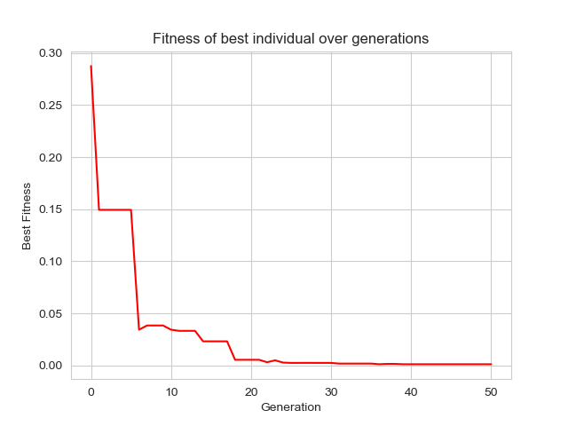
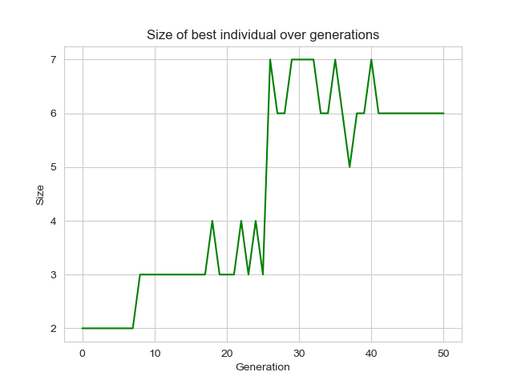

# GeneticProgrammingExpression
Python implementation of genetic programming that solves a symbolic expression.

The following graph shows the result a DEAP-based GP with the following parameters:
- Crossover with probability = 0.7
- Mutation with probability = 0.0
- Generations = 50

